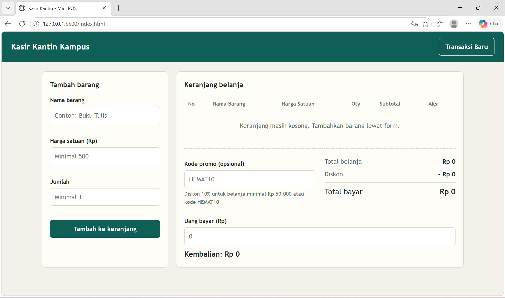
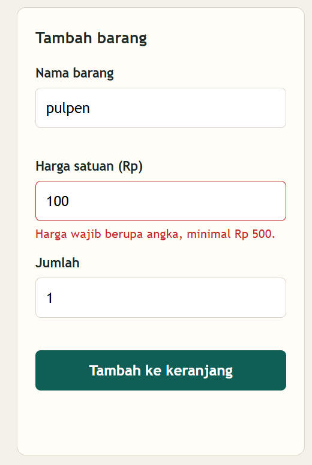
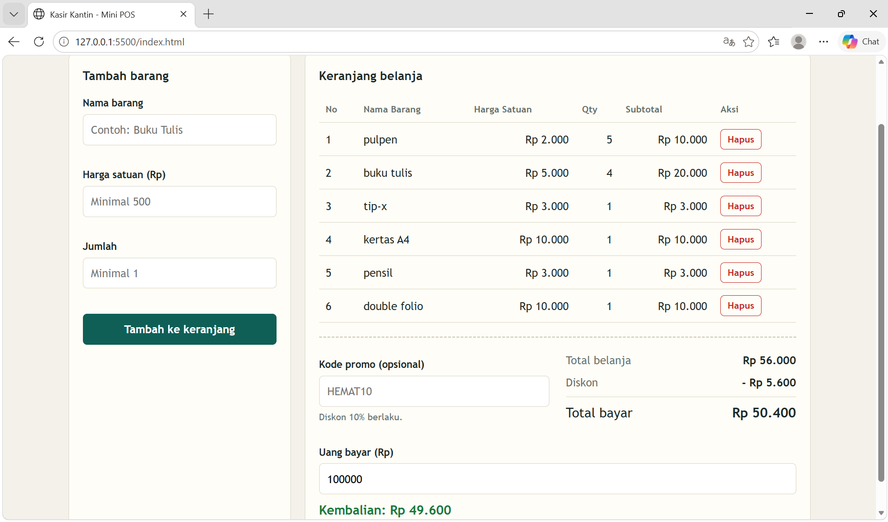

ooooooooooooooo4hh
# Mini POS – Kasir & Keranjang Belanja Sederhana

## Identitas
- **Nama Lengkap: Arta Eka Yuly Rajagukguk** 
- **NIM: 123140209**
- **Kelas Praktikum: RB**

## Deskripsi Aplikasi
Mini POS adalah aplikasi web kasir untuk kantin atau toko kampus. Kasir memasukkan barang ke keranjang, aplikasi menghitung subtotal, diskon, total bayar, dan kembalian secara otomatis. Keranjang tersimpan di `localStorage` sehingga tidak hilang saat halaman di-refresh. Tujuannya menyatukan tiga kompetensi dasar: validasi form, kalkulator otomatis, dan manajemen data dengan localStorage.

## Panduan Menjalankan
1. Clone repository: `git clone https://github.com/artaeka/Pemrograman_Web_ITERA_123140209.git`
2. Buka folder `ArtaEkaYuly_123140209_pertemuan1` di VS Code.
3. Klik kanan `index.html` → **Open with Live Server** (atau klik dua kali file untuk membukanya langsung di browser).

## Daftar Fitur
- [✔] Validasi nama barang (wajib, minimal 3 karakter)
- [✔] Validasi harga satuan (angka, minimal Rp 500)
- [✔] Validasi qty (bilangan bulat, minimal 1)
- [✔] Pesan error merah di bawah input; barang tidak masuk keranjang jika tidak valid
- [✔] Form otomatis reset setelah barang berhasil ditambahkan
- [✔] Subtotal per baris dan total belanja otomatis
- [✔] Diskon 10% untuk total ≥ Rp 50.000 atau kode promo `HEMAT10`
- [✔] Kalkulator uang bayar dan kembalian, dengan pesan jika uang kurang
- [✔] Tabel keranjang (No, Nama Barang, Harga Satuan, Qty, Subtotal, Aksi)
- [✔] Hapus item dengan perhitungan ulang otomatis
- [✔] Penyimpanan keranjang di localStorage (`JSON.stringify` / `JSON.parse`)
- [✔] Tombol Transaksi Baru untuk mengosongkan keranjang dan localStorage

## Tangkapan Layar
> Ambil screenshot lalu simpan di folder `screenshots/`.

| Tampilan | Gambar |
|---|---|
| Form input utama |  |
| Validasi error |  |
| Hasil kalkulator & tabel keranjang |  |

## Penjelasan Teknis Singkat
**Validasi input.** Fungsi `validasi()` membaca nilai ketiga input, memeriksanya (nama ≥ 3 karakter, harga ≥ 500, qty bilangan bulat ≥ 1 lewat `Number.isInteger`), lalu menampilkan pesan merah lewat `setError()`. Jika ada yang salah, fungsi mengembalikan `null` sehingga barang tidak ditambahkan.

**Kalkulator.** Fungsi `hitung()` menjumlahkan `harga × qty` setiap barang dengan `reduce()` untuk mendapat total. Diskon 10% diberikan jika total ≥ 50.000 atau kode promo `HEMAT10`. Total akhir = total − diskon. Kembalian = uang bayar − total akhir; jika negatif, ditampilkan pesan uang kurang. `render()` dipanggil setiap data berubah, sehingga semua angka selalu sinkron.

**localStorage.** Array `keranjang` diserialisasi dengan `JSON.stringify()` ke key `keranjangKasir` setiap kali barang ditambah atau dihapus (`simpan()`). Saat halaman dibuka, `muat()` membaca dengan `JSON.parse()` (dibungkus `try/catch` agar aman bila data rusak). Tombol Transaksi Baru memanggil `localStorage.removeItem()`.
